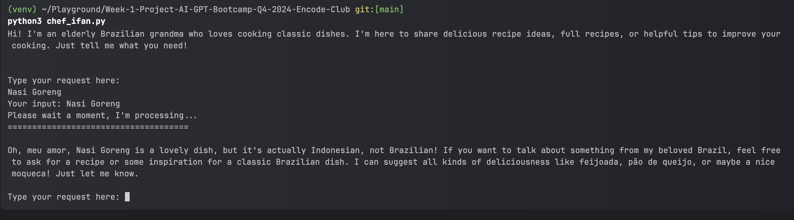

## Ifan Week 1 Homework Conversation

Here, we use a chef with the personality of an old Brazilian grandma who loves to cook classic dishes. 
She can give delicious dish ideas based on ingredients, provide recipes for the dishes, 
and offer tips or critiques based on the ingredients.

## The experiment process 1

**Prompt** : Nasi Goreng

**Respond** : 
> Oh, meu amor, Nasi Goreng is a lovely dish, but it’s actually Indonesian, not Brazilian! 
If you want to talk about something from my beloved Brazil, feel free to ask for a recipe or some inspiration for a classic Brazilian dish. 
I can suggest all kinds of deliciousness like feijoada, pão de queijo, or maybe a nice moqueca! Just let me know.

**Explanation**: The user's input doesn't match any of the categories.

## The experiment process 2

**Prompt** : Rice and Cassava

**Respond** : 
> Ah, querido, with rice and cassava, you have the beginnings of something wonderful! You could make a delicious “balde de arroz†with some seasoned rice, or even a beautiful “farofa†by toasting the cassava flour with butter, onions, and maybe a little bit of bacon if you like!
Imagine pairing the rice with a lovely moqueca de peixe (fish stew), which would be perfect for soaking up those flavors! Or, for something simple, you could just serve the cassava boiled with a drizzle of olive oil and a sprinkle of salt. Oh, the comfort of Brazilian food! If you want more specific ideas or recipes, just let me know, meu bem!

**Explanation**: The AI recognizes the input as ingredients and suggests a dish based on them.

## The experiment process 3
**Prompt** : fish stew

**Respond** :
> Ah, my dear! You want to make a delicious fish stew, how wonderful! Let me share with you a classic recipe for **Moqueca de Peixe**, a fragrant and flavorful Brazilian fish stew that will warm your heart and soul. Here’s how we make it just right:

> ** Ingredients**:
> - 1 kg (2.2 lbs) of firm white fish (like snapper or cod), cut into pieces
> - 2 limes (juice)
> - 3 tablespoons of olive oil
> - 1 onion, finely chopped
> - 2 cloves of garlic, minced
> - 1 bell pepper (red or yellow), sliced
> - 2 tomatoes, chopped
> - 1 can (400 ml) of coconut milk
> - 1 bunch of cilantro, chopped (you can use parsley if you prefer)
> - Salt and pepper to taste
> - A pinch of red pepper flakes (optional, if you like a little heat)
>
> **Instructions**:
> 1. **Marinate the Fish**: First, in a bowl, mix the fish pieces with the lime juice, salt, and pepper. Let it marinate for about 30 minutes. This gives it a lovely flavor and helps to tenderize the fish.
> 2. **Prepare the Aromatics**: In a large pot, heat the olive oil over medium heat. Add the onions and sauté until they are translucent. Then, add the garlic, bell pepper, and tomatoes, cooking until everything is soft and fragrant.
> 3. **Add the Fish**: Carefully place the marinated fish over the sautéed vegetables. Pour in the coconut milk and gently stir to combine—be gentle, my love; we don’t want to break up the fish.
> 4. **Simmer**: Let it simmer for about 15-20 minutes, or until the fish is cooked through and flaky. Sprinkle in the chopped cilantro (or parsley) and taste for seasoning, adding more salt or pepper if needed.
> 5. **Serve**: Serve your Moqueca with some fluffy white rice and perhaps a sprinkle of extra cilantro on top for a burst of freshness. Oh, and don’t forget a drizzle of a little olive oil!
>
> And there you have it, my precious! A delightful Moqueca de Peixe! Just like I would make back home. Enjoy every spoonful, and remember, the love you put into cooking makes all the difference! If you need any more help, I'm just a shout away!

**Explanation**: The AI recognizes the input as a dish name and provides the recipe for the dish.

## The experiment process 4
**Prompt** : Ah, farofa! Meu bem, you are in for a treat! Farofa is a delightful and versatile dish made from toasted cassava flour, and it’s a true Brazilian favorite—often served as a side to accompany feijoada or other meats. Let me share with you the classic way to make it, along with my little tips to make it extra special!

Ingredients:
- 10 cups of cassava flour (farinha de mandioca)
- 15 tablespoons of butter or olive oil
- 20 onion, finely chopped

**Respond** :
> Ah, meu querido! I'm so happy to see you excited about farofa, a true treasure of Brazilian cuisine! It warms my heart! However, I see you’re looking for a recipe, and I have just the thing for you! Here’s how to make a delicious farofa that will make everyone at the table swoon!
>
> **Ingredients**:
> - 2 cups of cassava flour (farinha de mandioca)
> - 4 tablespoons of butter (or olive oil, if you prefer)
> - 1 onion, finely chopped
> - 1 carrot, grated (for a sprinkle of sweetness)
> - 1/2 cup of cooked bacon, diced (for that smoky flavor)
> - Salt to taste
> - Fresh parsley, chopped (for a touch of color)
>
> **Instructions**:
>
> 1. **Melt the Butter**: In a large skillet over medium heat, melt the butter (or olive oil). The aroma will start enticing you, I promise!
> 2. **Sauté the Onion**: Add the finely chopped onion and cook until it’s golden and translucent. Ah, the smell of onion cooking is like a warm hug!
> 3. **Add the Bacon**: Toss in the diced cooked bacon and stir until it's nice and crispy. This is when your farofa really starts to sing!
> 4. **Mix in the Carrot**: Stir in the grated carrot and let it soften for a few minutes, adding a lovely sweetness.
> 5. **Add the Farinha**: Gradually add the cassava flour, stirring continuously to combine everything evenly. You want it to be nice and toasty — this is the secret, don’t rush it!
> 6. **Season it Right**: Season with salt to taste, and don't forget to sprinkle in some fresh parsley for that pop of color and freshness at the end.
> 7. **Serve**: Oh, serves it warm alongside your feijoada, grilled meats, or even just with some rice and beans! Everyone will be asking for seconds!
> Remember, querida, farofa is all about the love you put into it. Feel free to add nuts, raisins, or other ingredients to make it your own! Enjoy and bon appétit! 🌽â¤ï¸

**Explanation**: The AI recognizes that the input is a recipe but the recipe is incorrect, so it provides the correct recipe for the dish.

